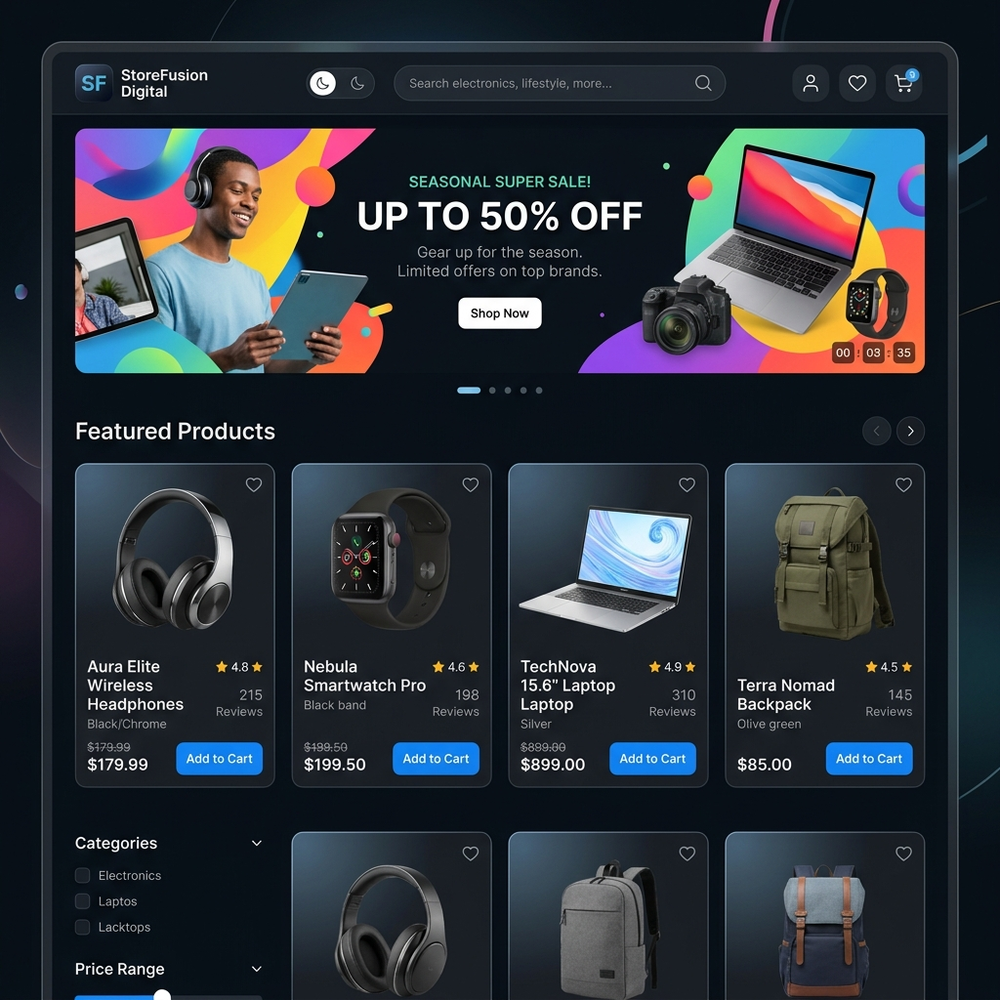
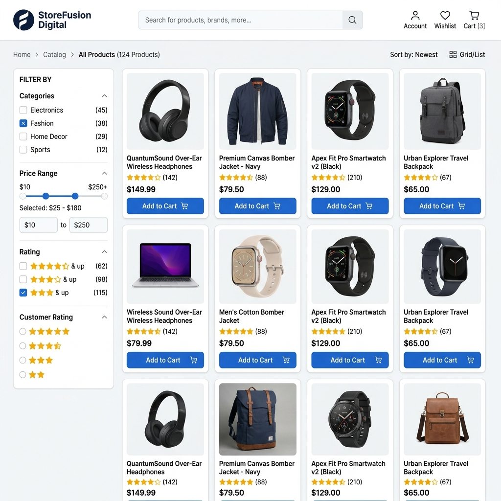
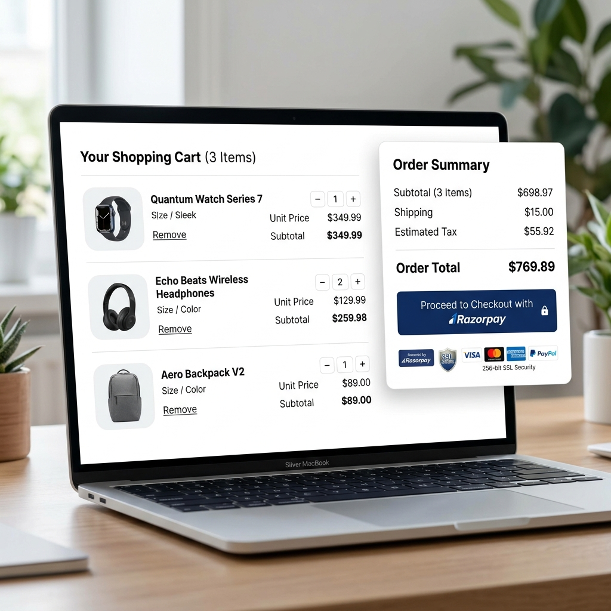

# StoreFusion Digital

<div align="center">

[](https://reactjs.org/)
[](https://vitejs.dev/)
[](https://redux-toolkit.js.org/)
[](https://tailwindcss.com/)
[](https://firebase.google.com/)
[](https://razorpay.com/)

**A full-stack e-commerce application built with React, Redux Toolkit, and Firebase, featuring interactive customer reviews, persistent cart state, and integrated Razorpay payments.**

[Live Demo](#live-demo) • [Tech Stack](#tech-stack) • [Key Features](#key-features) • [Quick Start](#quick-start) • [Screenshots](#project-screenshots)

</div>

---

## Short Project Description

StoreFusion Digital is a production-ready single-page e-commerce application designed to provide a complete customer purchasing workflow. It integrates real-time database operations, user authentication, responsive design, and payment processing. The application emphasizes state persistence, component reusability, and clean data flow architecture.

---

## Live Demo

- **Production Deployment:** [https://storefusion-digital.vercel.app](https://storefusion-digital.vercel.app)
- **Mirror Deployment:** [https://e-commerce-storefusion.web.app](https://e-commerce-storefusion.web.app)

> [!TIP]
> **Testing Instructions:**
> - Add items to the cart and refresh the page to observe automatic local state persistence via `redux-persist`.
> - Navigate to any product details page to test the interactive testimonial submission and 5-star rating flow.
> - Sign in with test credentials to evaluate protected checkout and administration features.

---

## Tech Stack

- **Frontend Core:** React 18 (`v18.3.1`), Vite (`v7.3.1`), React Router DOM (`v7.14.0`)
- **State Management:** Redux Toolkit (`v2.2.7`), `redux-persist` (`v6.0.0`)
- **Styling & UI:** Tailwind CSS (`v3.4.12`), Material UI (`@mui/material`), Framer Motion, Emotion
- **Backend Services:** Firebase Authentication, Firebase Realtime Database / Firestore (`v12.10.0`)
- **Payment Processing:** Razorpay Checkout Gateway SDK
- **Data Visualization:** Chart.js (`v4.4.4`), `react-chartjs-2`

---

## Key Features

- **Interactive Testimonials & Review System:** Full review management allowing authenticated users to submit, edit, and delete feedback with 5-star ratings, synced with Firebase (`AddTestimonial.jsx`, `SingleReviewCard.jsx`).
- **Persistent Shopping Cart:** Utilizes `redux-persist` to store cart contents across browser reloads, calculating real-time subtotals, shipping, and tax.
- **Dynamic Catalog Filtering:** Supports instant search queries, category filters (Electronics, Fashion, Home Decor), and price range adjustments on `/allproducts`.
- **User Authentication & Authorization:** Implements secure Firebase sign-up, sign-in, session retention, and route protection for order histories and administrative tools.
- **Integrated Payment Gateway:** Seamless Razorpay payment checkout modal supporting UPI, Debit/Credit Cards, NetBanking, and Wallets.
- **Administrative Console:** Dedicated `/admin` route for inventory monitoring, customer order management, and moderation of customer reviews.

---

## Quick Start

### 1. Clone the Repository
```bash
git clone https://github.com/Tausifqureshi/StoreFusion-Digital.git
cd StoreFusion-Digital
```

### 2. Install Dependencies
```bash
npm install
```

### 3. Run Development Server
```bash
npm run dev
```
Open `http://localhost:5173` in your browser to view the application.

### 4. Production Build
```bash
npm run build
npm run preview
```

---

## Project Screenshots

### 1. Home Page & Hero Section


---

### 2. Product Catalog & Category Filters


---

### 3. Product Details & Interactive Customer Reviews


---

### 4. Shopping Cart & Razorpay Checkout


---

## Developer Information

- **Developer:** Tausif Qureshi
- **GitHub:** [https://github.com/Tausifqureshi](https://github.com/Tausifqureshi)
- **Repository:** [StoreFusion-Digital](https://github.com/Tausifqureshi/StoreFusion-Digital)
- **License:** MIT License
